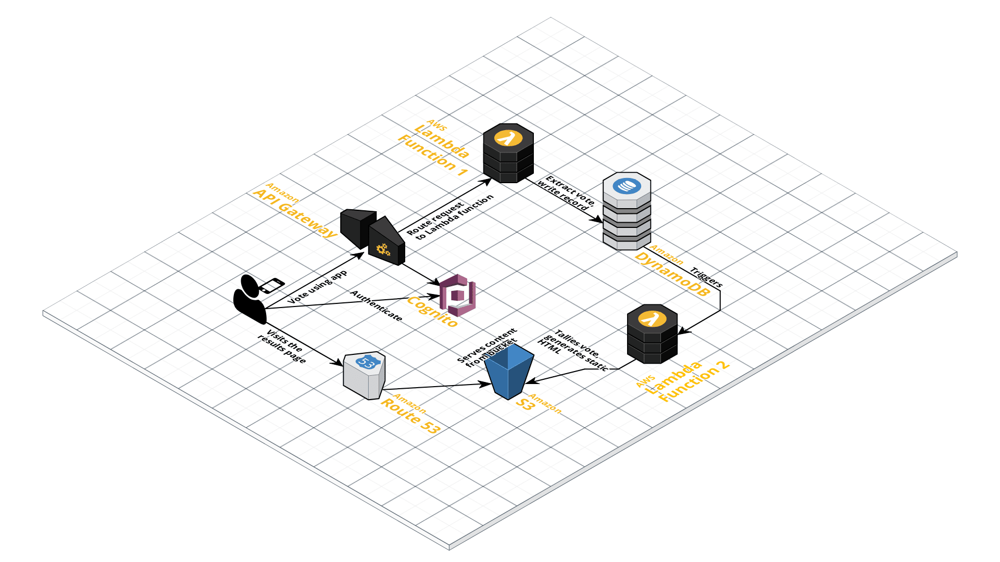

# API Gateway Challenge from apigwx

## Background
A cloud engineer working for Company X created a Cloudformation template to deploy a serverless API
service which will receive and store data about sports teams into a NoSQL database.

After deploying the stack, although the AWS Cloudformation stack is successfully created, when the API
receives a POST request the engineer is facing some issues and data is not being written to the table as
expected.

The Cloudformation stack mainly deploys the following AWS resources:

|Service        |Description|
|---------------|-----------|
|API Gateway    |Handles the http traffic|
|Role           |Role to be used by Lambda Function|
|Lambda Function|Extract data from the http request and update the database|
|DynamoDB Table |NoSQL Database|

## Problem Statement:

 - Make the necessary changes so data is successfully written to the DynamoDB Table once a POST request is received by the API Gateway - Done
 - Add any required resources to send a message to a SNS Topic whenever a new item is added to the DynamoDB Table. The message can be either table updated or the content of the new item added - Done
 - (Optional)Implement any type of authentication to the API Gateway - ToDo

## Considerations:
 - Share your code with us through your own git repository. Add user to private repo
 - Consider security on all pieces of your work
 - Make sure that all resources required by your stack are included on the deployment process
 - Include a README with details on how to run your code. Add a section with recommended improvements for this stack
 - On the same README file, include a section with recommended improvements to be done on the stack/repo that you consider important

## Assumptions/Thinking Pattern:
 - External facing API
 - AWS Managed KMS key is Default for DynamoDB for now. Need to consider Customer Managed Keys for Storing Data.
 - Table updated means new entry in the table
 - Content updated means existing entry updated in table
 - Stack policy is set to be permissive for now. Would need to consider locking down DB updates for production data
 - Not using Nested stacks. Can be difficult to maintain and its good to avoid tight integrations(possibly at the cost of some duplication)
 - Ansible provides a good layer of abstraction over cloudformation and has the ability to interact with services outside of AWS
 - Working software first and gradually improving on other aspects like security, performance etc.

## Steps:
 1. Deploy the stack using awscli and Cloudformation - Done
 2. Make the necessary changes so data is successfully written to the DynamoDB Table once a POST request is received by the API Gateway - Done
 3. Make application modular and parameterized using Ansible - Done
 4. Send a message to a SNS Topic whenever a new item is added - Done
 5. Improve security - IAM Permissions, Environment Variables, Server Side Encryption, Documentation..  - In progress
 6. Implement API Gateway Authentication - Cognito? - ToDo

## Implementation : Using Ansible + CloudFormation + API Gateway + DynamoDB + SNS

### Execution & Deployment: 
 * Install Docker CE: https://download.docker.com/
 * Update Ansible inventory at: `inventory/development`
 * Set AWS Credentials: `source <creds-file>`
 * To Deploy Run: `./deploy.sh`
    
    Contains the following commands:
    ```
    docker-compose build
    docker-compose run --rm deploy ansible-playbook deploy-db.yml -i inventory/development/ --e "database_name=apigwx state=present"
    docker-compose run --rm deploy ansible-playbook deploy-api.yml -i inventory/development/ --e "stage_name=v1 database_name=apigwx state=present"
    docker-compose down
    ```
 * To Destroy Run: `./destroy.sh`
    
    Contains the following commands:
    ```
    docker-compose build
    docker-compose run --rm deploy ansible-playbook deploy-api.yml -i inventory/development/ --e "stage_name=v1 database_name=apigwx state=absent"
    docker-compose run --rm deploy ansible-playbook deploy-db.yml -i inventory/development/ --e "database_name=apigwx state=absent"
    docker-compose down
    ```
### Testing Post Request
 - `curl -i --header "Content-Type: application/json" \
        --request POST --data '{"team_name":"apigwx","team_country":"au","team_desc":"team apigwx is the best","team_rating":"10"}' \
        'https://n24n4y9vgk.execute-api.ap-southeast-2.amazonaws.com/v1/add_new'`

## Future Considerations: Security and Enhancements
 - Deploying Using CI - Self Hosted(Bamboo,GoCD, ConcourseCI) vs Service(Shippable, Buildkite)
 - Cost Considerations: https://alestic.com/2016/12/aws-invoice-example/
 - Need to consider using containers for deployment to avoid dependency and version issues - DONE
 - Authentication using Cognito(Auth0? cost vs value) depending on use case
 - Consider moving code to separate directory and improving(for running Lint, TDD etc) and using `aws cloudformation package` before deploy
 - Create DNS Endpoint and Server with a SSL Cert, Maybe use Cloudfront?
 - Manage/Restrict Access with:
    - Cross-origin resource sharing: control how your REST API responds to cross-domain resource requests
    - Client Side SSL Certs: verify that HTTP requests to your backend system are from API Gateway
    - AWS WAF: protect your API Gateway API from common web exploits
    - IAM Roles and policies
    - API Keys with usage quota limiting
    - Lambda Authorizer Functions
 - Blue Green Deployments with api safety: v1->v2->v3...
 - Better Tagging of Resources
 
## Future Roadmap Example #1

[](https://www.puresec.io/blog/aws-security-best-practices-for-api-gateway)